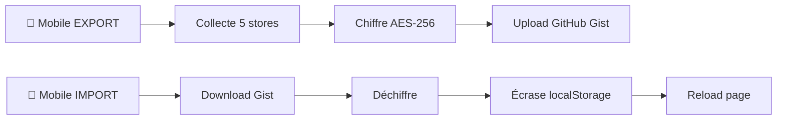

# 📱 Architecture Mobile Companion - IRIMMetaBrain

> Interface mobile parallèle avec synchronisation ultra-simple et architecture modulaire

**Version :** 3.0.0
**Type :** Mobile PWA Architecture
**Intégration :** Stores partagés avec desktop

## 🎯 Vue d'Ensemble

### Interface Mobile Autonome
IRIMMetaBrain Companion est une **interface mobile complète** qui partage les mêmes stores Zustand que l'interface desktop, permettant une synchronisation transparente des données.

### Architecture Multi-Stores Intégrée
```
🖥️ Desktop StudioHall     ↔️     📱 Mobile Companion
├── useNotesStore          ←────→  ├── HomePage (Diary)
├── useProjectMetaStore    ←────→  ├── AtelierPage (Projects)
├── useProjectDataStore    ←────→  ├── DevPage (Notes)
├── useDiaryStore          ←────→  └── SettingsPage (Sync)
└── usePreferencesStore
```

## 🏗️ Architecture Technique

### Routing Structure
```javascript
<BrowserRouter>
  <Routes>
    {/* Desktop - Interface spatiale complète */}
    <Route path="/" element={
      <AccessGate>
        <StudioHall />
      </AccessGate>
    } />

    {/* Mobile - Interface TabBar optimisée */}
    <Route path="/companion/*" element={
      <AccessGate>
        <CompanionApp />
      </AccessGate>
    }>
      <Route path="home" element={<HomePage />} />
      <Route path="atelier" element={<AtelierPage />} />
      <Route path="dev" element={<DevPage />} />
      <Route path="settings" element={<SettingsPage />} />
    </Route>
  </Routes>
</BrowserRouter>
```

### Sécurité Partagée
- **AccessGate** : Même système de sécurité symbolique desktop/mobile
- **Variables d'environnement** : `VITE_ACCESS_PASSWORD` partagé
- **SessionStorage** : État de connexion temporaire par onglet

## 📱 Navigation Mobile

### TabBar Architecture
```
TabBarContainer (position: fixed, bottom: 0)
├── TabButton (🏠 Home)      → /companion/home
├── TabButton (🔧 Atelier)   → /companion/atelier
├── TabButton (💻 Dev)       → /companion/dev
└── TabButton (⚙️ Settings)  → /companion/settings
```

**Indicateur actif** : Barre dorée top + couleur accentuée du thème

### Pages Principales

#### 🏠 HomePage (`/companion/home`)
**Objectif** : Central d'accueil avec mantras et journal

**Composants intégrés** :
- `QuoteCarousel` → Mantras et citations inspirantes
- `Diary` → Journal quotidien avec archivage automatique

**Store connecté** : `useDiaryStore`
```javascript
// Accès aux données journal
const { dailyDiary, markdownNotes } = useDiaryStore()
```

#### 🔧 AtelierPage (`/companion/atelier`)
**Objectif** : Gestion projets et organisation mobile

**Composants intégrés** :
- Sélecteur projet actif (useProjectMetaStore)
- TodoList compact du projet sélectionné
- MindLog rapide (useDiaryStore)

**Architecture responsive** :
```javascript
const { selectedProject } = useProjectMetaStore()
const projectData = useProjectData(selectedProject)
const { todoMarkdown } = projectData
```

#### 💻 DevPage (`/companion/dev`)
**Objectif** : Prise de notes techniques nomade

**Composants** :
- `MarkdownEditor` (fullscreen mobile)
- Notes techniques dans `useNotesStore.companionNotes.devNote`

**Features clés** :
- Édition Markdown GitHub Flavored
- Sauvegarde automatique (debounce 1000ms)
- Export/Import via système de sync ultra-simple

#### ⚙️ SettingsPage (`/companion/settings`)
**Objectif** : Configuration et synchronisation

**Sections principales** :
1. **Synchronisation GitHub Gist** :
   - Status configuration (✅/❌ selon variables d'env)
   - Bouton EXPORT/IMPORT (même logique que desktop)
   - Dernier sync timestamp

2. **Application** :
   - Version IRIMMetaBrain
   - Mode Companion PWA
   - Détection device/plateforme

3. **Données locales** :
   - Utilisation localStorage
   - Stores actifs
   - Reset d'urgence

## 💾 Synchronisation Multi-Stores

### Architecture Sync Unifiée v3.0
Le mobile partage exactement la **même infrastructure de sync** que le desktop.

**Variables d'environnement partagées** :
```bash
# .env.local (identique desktop/mobile)
VITE_GITHUB_TOKEN=ghp_votre_token
VITE_SYNC_PASSWORD=votre_password_complexe
VITE_SYNC_GIST_ID=gist_id_optionnel
VITE_ACCESS_PASSWORD=password_app
```

### Format Export/Import v2.0
```json
{
  "version": "2.0.0",
  "architecture": "multi-store",
  "timestamp": "2025-10-01T10:00:00Z",
  "stores": {
    "notes": {
      "roomNotes": {},
      "sideTowerNotes": {},
      "companionNotes": {          // ← Notes mobile
        "devNote": "markdown content",
        "lastSync": "2025-10-01T10:00:00Z"
      }
    },
    "projectMeta": { ... },        // Métadonnées projets
    "projectData": { ... },        // Données par projet
    "diary": { ... },              // Journal personnel
    "preferences": { ... }         // Préférences UI
  }
}
```

### Flow de Synchronisation


## 🔧 PWA Configuration

### Manifest.json
```json
{
  "name": "IRIM MetaBrain Companion",
  "short_name": "IMB Companion",
  "start_url": "/companion",
  "display": "standalone",
  "scope": "/companion",
  "orientation": "portrait-primary",
  "theme_color": "#8B4513",
  "background_color": "#2A1810",
  "icons": [
    {
      "src": "/icons/icon-192.png",
      "sizes": "192x192",
      "type": "image/png"
    },
    {
      "src": "/icons/icon-512.png",
      "sizes": "512x512",
      "type": "image/png"
    }
  ]
}
```

### Meta Tags Optimisées
```html
<!-- Viewport mobile -->
<meta name="viewport" content="width=device-width, initial-scale=1.0, maximum-scale=1.0, user-scalable=no">

<!-- PWA -->
<link rel="manifest" href="/manifest.json">
<meta name="theme-color" content="#8B4513">

<!-- iOS Safari -->
<meta name="apple-mobile-web-app-capable" content="yes">
<meta name="apple-mobile-web-app-status-bar-style" content="black-translucent">
<meta name="apple-mobile-web-app-title" content="IMB Companion">
```

## 📐 Design Responsive

### Breakpoints Architecture
```javascript
// Theme système partagé desktop/mobile
const breakpoints = {
  mobile: '768px',
  tablet: '1024px',
  desktop: '1200px'
}

// Détection automatique
const isMobile = window.innerWidth < 768
```

### Layout Mobile Optimisé
```css
/* CompanionApp Container */
.companion-app {
  display: flex;
  flex-direction: column;
  height: 100vh;
  background: var(--colors-metalBg);
}

/* Content Area */
.content-area {
  flex: 1;
  overflow-y: auto;
  padding: 16px;
  padding-bottom: 80px; /* TabBar space */
}

/* TabBar Fixed */
.tab-bar {
  position: fixed;
  bottom: 0;
  left: 0;
  right: 0;
  height: 64px;
  background: var(--colors-primaryLevel);
  z-index: 1000;
}
```

## ⚡ Performance & Optimisation

### Architecture Modulaire
- **Réutilisation composants** : QuoteCarousel, Diary, MarkdownEditor
- **Stores partagés** : Pas de duplication logique métier
- **Bundle commun** : Desktop et mobile partagent le même build

### Lazy Loading
```javascript
// Routes chargées à la demande
const HomePage = lazy(() => import('./pages/HomePage'))
const AtelierPage = lazy(() => import('./pages/AtelierPage'))
const DevPage = lazy(() => import('./pages/DevPage'))
const SettingsPage = lazy(() => import('./pages/SettingsPage'))
```

### Métriques Typiques
```
Bundle mobile : ~50-80KB (gzip)
Temps load : 1-3s (3G)
Stores total : ~50-100KB (localStorage)
PWA install : iOS/Android compatible
```

## 🔒 Sécurité Mobile

### Authentification Partagée
Le mobile utilise exactement le **même système de sécurité symbolique** que le desktop :

```javascript
// Route mobile avec AccessGate
<Route path="/companion/*" element={
  <AccessGate>
    <CompanionApp />
  </AccessGate>
}>
```

### Protection Variables d'Environnement
- **Variables sensibles** : Jamais exposées côté client
- **Session temporaire** : sessionStorage (effacé à fermeture onglet)
- **Gist chiffré** : AES-256 avec `VITE_SYNC_PASSWORD`

### Données Locales
```javascript
// localStorage structure mobile
{
  "project-meta-store": "...",      // Métadonnées projets
  "irim-notes-store": "...",        // Notes (incluant companionNotes)
  "diary-storage": "...",           // Journal personnel
  "irim-preferences-store": "...",  // Préférences UI
  "irim-logged-in": "true"          // Session temporaire
}
```

## 🛠 Debug et Maintenance

### Commandes Debug Mobile
```javascript
// Console navigateur mobile
window.__ZUSTAND_STORES__.notes()       // Notes incluant companionNotes
window.__ZUSTAND_STORES__.diary()       // Journal mobile
window.__ZUSTAND_STORES__.projectMeta() // Projets

// Forcer sync mobile
window.__SYNC_TOOLS__.collectAllStoreData()
window.__SYNC_TOOLS__.cleanupOrphanedProjects()

// Reset mobile d'urgence
localStorage.clear()
sessionStorage.clear()
window.location.reload()
```

### Tests de Compatibilité
```
✅ iOS Safari (12+)
✅ Android Chrome (70+)
✅ iPad Safari (responsive)
✅ PWA Installation (iOS/Android)
✅ Rotation écran
✅ TabBar navigation
✅ Sync cross-device
```

## 🚀 Évolutions Futures

### v3.1 - Fonctionnalités Avancées
- [ ] **Push notifications** : Sync automatique background
- [ ] **Offline mode** : Service Worker avec cache
- [ ] **Widget natifs** : Shortcuts iOS/Android
- [ ] **Share API** : Partage notes via système mobile

### v3.2 - UI/UX Mobile
- [ ] **Thème sombre** : Mode nuit automatique
- [ ] **Gestures** : Swipe navigation between tabs
- [ ] **Haptic feedback** : Vibrations tactiles
- [ ] **Voice input** : Dictée vocale pour notes

### v4.0 - Architecture Avancée
- [ ] **IndexedDB** : Storage performant grandes données
- [ ] **WebRTC** : Sync temps réel P2P
- [ ] **WebAssembly** : Chiffrement optimisé
- [ ] **Service Worker** : Background sync intelligent

## 📚 Documentation Liée

- **[🔄 Système de Synchronisation](guides/sync-system.md)** - Guide sync ultra-simple
- **[⚙️ Configuration Environnement](guides/environment-setup.md)** - Variables d'env
- **[🛡️ Système de Sécurité](architecture/security-system.md)** - LoginPage/AccessGate
- **[🏗️ Architecture Stores](architecture/stores-architecture.md)** - Multi-stores v2.0

---

**Status :** ✅ Production Ready
**Version :** 3.0.0
**Compatibilité :** iOS 12+, Android 8+, Desktop responsive
**Mainteneurs :** IRIM Team
