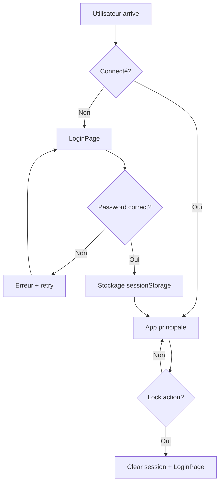

# 🛡️ Système de Sécurité Symbolique - IRIMMetaBrain

> Architecture de protection d'accès minimaliste et élégante

**Version :** 1.0.0
**Type :** Sécurité symbolique (non cryptographique)
**Objectif :** Empêcher l'accès accidentel, pas la sécurité militaire

## 🎯 Philosophy & Objectifs

### Sécurité Symbolique
- **Protection légère** contre accès non autorisé
- **Pas de sécurité cryptographique** avancée
- **Focus UX** : élégant et non intrusif
- **Setup simple** : variable d'environnement unique

### Cas d'usage
```
✅ Empêcher collègues/famille d'accéder par erreur
✅ Protection basique en démo/présentation
✅ Filtre d'accès pour environnements partagés
❌ Protection contre attaques ciblées
❌ Sécurité niveau entreprise/gouvernemental
```

## 🏗️ Architecture Technique

### Vue d'ensemble du flux



### Composants principaux

```
src/components/auth/
├── AccessGate.jsx          → Wrapper validation accès
├── LoginPage.jsx           → Interface connexion
└── LockButton.jsx          → Bouton déconnexion
```

## 🔑 Composant: LoginPage

### Responsabilité
Interface de connexion élégante avec validation mot de passe.

### Props & Configuration
```jsx
// Pas de props - configuration via environnement
const SIMPLE_PASSWORD = import.meta.env.VITE_ACCESS_PASSWORD || 'metabrain2024';
```

### État interne
```jsx
const [password, setPassword] = useState('');
const [error, setError] = useState('');
const [isLoading, setIsLoading] = useState(false);
```

### Interface utilisateur
```jsx
return (
  <LoginContainer>
    <LoginCard>
      {/* Logo château 🏰 + titre "IRIM MetaBrain" */}
      <LogoSection>
        <CastleIcon>🏰</CastleIcon>
        <Title>IRIM MetaBrain</Title>
        <Subtitle>Meta-cerveau spatial pour développeurs TDA/H</Subtitle>
      </LogoSection>

      {/* Formulaire connexion */}
      <LoginForm onSubmit={handleLogin}>
        <PasswordInput
          type="password"
          value={password}
          onChange={(e) => setPassword(e.target.value)}
          placeholder="Mot de passe d'accès"
        />
        {error && <ErrorMessage>{error}</ErrorMessage>}
        <LoginButton type="submit" disabled={isLoading}>
          {isLoading ? 'Connexion...' : 'Accéder'}
        </LoginButton>
      </LoginForm>

      {/* Footer info */}
      <Footer>
        Accès restreint • Sécurité symbolique
      </Footer>
    </LoginCard>
  </LoginContainer>
);
```

### Logique de validation
```jsx
const handleLogin = (e) => {
  e.preventDefault();
  setIsLoading(true);
  setError('');

  // Validation simple (délai pour UX)
  setTimeout(() => {
    if (password === SIMPLE_PASSWORD) {
      // Succès: stockage session + redirection
      sessionStorage.setItem('irim-logged-in', 'true');
      onLogin(); // Callback vers App.jsx
    } else {
      // Échec: message d'erreur
      setError('Mot de passe incorrect');
      setPassword(''); // Clear pour retry
    }
    setIsLoading(false);
  }, 800); // Délai réaliste pour simulation authentification
};
```

## 🔐 Composant: AccessGate

### Responsabilité
Wrapper de validation d'accès avec gestion état session.

### Usage
```jsx
// Dans App.jsx
import AccessGate from './components/auth/AccessGate';

function App() {
  return (
    <AccessGate>
      {/* Contenu principal application */}
      <StudioHall />
    </AccessGate>
  );
}
```

### État et logique
```jsx
const AccessGate = ({ children }) => {
  const [isLoggedIn, setIsLoggedIn] = useState(false);
  const [isChecking, setIsChecking] = useState(true);

  // Vérification état session au chargement
  useEffect(() => {
    const checkAuthStatus = () => {
      const loggedIn = sessionStorage.getItem('irim-logged-in') === 'true';
      setIsLoggedIn(loggedIn);
      setIsChecking(false);
    };

    checkAuthStatus();
  }, []);

  // Handler connexion réussie
  const handleLogin = () => {
    setIsLoggedIn(true);
  };

  // Handler déconnexion (depuis LockButton)
  const handleLogout = () => {
    sessionStorage.removeItem('irim-logged-in');
    setIsLoggedIn(false);
  };

  // États d'affichage
  if (isChecking) {
    return <LoadingScreen />; // Spinner durant vérification
  }

  if (!isLoggedIn) {
    return <LoginPage onLogin={handleLogin} />;
  }

  return (
    <AuthContext.Provider value={{ logout: handleLogout }}>
      {children}
    </AuthContext.Provider>
  );
};
```

## 🔒 Composant: LockButton

### Responsabilité
Bouton de déconnexion dans ControlTower pour "verrouiller" l'accès.

### Intégration ControlTower
```jsx
// Dans ControlTower.jsx
import LockButton from './LockButton';

const ControlTower = () => {
  return (
    <TowerContainer>
      {/* Autres boutons tour de contrôle */}
      <SyncButton onClick={() => openModal('sync')} />
      <LockButton /> {/* Bouton lock en bas */}
    </TowerContainer>
  );
};
```

### Logique de déconnexion
```jsx
const LockButton = () => {
  const { logout } = useContext(AuthContext);

  const handleLock = () => {
    // Confirmation optionnelle
    const confirm = window.confirm('Verrouiller l\'accès à IRIMMetaBrain ?');
    if (confirm) {
      logout(); // Clear session + retour LoginPage
    }
  };

  return (
    <LockButtonContainer onClick={handleLock} title="Verrouiller l'accès">
      🔒
    </LockButtonContainer>
  );
};
```

## 💾 Gestion Session

### Storage Strategy
```javascript
// Utilisation sessionStorage (temporaire par onglet)
const SESSION_KEY = 'irim-logged-in';

// Stockage connexion
sessionStorage.setItem(SESSION_KEY, 'true');

// Vérification statut
const isLoggedIn = sessionStorage.getItem(SESSION_KEY) === 'true';

// Déconnexion
sessionStorage.removeItem(SESSION_KEY);
```

### Pourquoi sessionStorage vs localStorage ?
```
sessionStorage (choisi):
✅ Effacé à fermeture onglet
✅ Sécurité accrue (session temporaire)
✅ UX: re-login après pause longue

localStorage (rejeté):
❌ Persistant entre sessions
❌ Moins sécurisé
❌ Risque accès permanent non désiré
```

### Gestion multi-onglets
```javascript
// Chaque onglet a sa propre session
// Avantage: Isolation naturelle
// Inconvénient: Re-login par onglet (acceptable pour sécurité symbolique)
```

## 🎨 Design System

### Couleurs et thème
```css
/* Cohérence avec Tower System */
--login-bg: var(--colors-metalBg);          /* Fond métallique */
--login-card: var(--colors-primaryLevel);   /* Carte principale */
--login-accent: var(--colors-primary);      /* Accent château */
--login-error: var(--colors-danger);        /* Messages erreur */
--login-text: var(--colors-text);           /* Texte principal */
--login-subtle: var(--colors-textSubtle);   /* Texte secondaire */
```

### Animations et transitions
```css
/* Animations élégantes */
.login-card {
  animation: slideUp 0.5s ease-out;
}

.login-form {
  transition: all 0.3s ease;
}

.error-message {
  animation: shake 0.3s ease-in-out;
}

/* Cohérence avec modales existantes */
@keyframes slideUp {
  from { opacity: 0; transform: translateY(20px); }
  to { opacity: 1; transform: translateY(0); }
}
```

### Responsive design
```css
/* Mobile-first approach */
.login-container {
  min-height: 100vh;
  padding: 1rem;
}

@media (min-width: 768px) {
  .login-card {
    max-width: 400px;
    margin: auto;
  }
}
```

## ⚙️ Configuration

### Variables d'environnement
```bash
# .env.local
VITE_ACCESS_PASSWORD=votre_mot_de_passe_choisi

# Fallback si non défini
# Code: import.meta.env.VITE_ACCESS_PASSWORD || 'metabrain2024'
```

### Bonnes pratiques mot de passe
```bash
# ✅ Recommandé
VITE_ACCESS_PASSWORD=MonApp2024!
VITE_ACCESS_PASSWORD=StudioHall-Access
VITE_ACCESS_PASSWORD=IRIM_MetaBrain_2024

# ❌ À éviter
VITE_ACCESS_PASSWORD=123456
VITE_ACCESS_PASSWORD=password
VITE_ACCESS_PASSWORD=admin
```

### Rotation des mots de passe
```bash
# 1. Changer dans .env.local
VITE_ACCESS_PASSWORD=nouveau_mot_de_passe

# 2. Redémarrer serveur dev
npm run dev

# 3. Informer utilisateurs du changement
# 4. Mettre à jour environnements de prod
```

## 🚀 Déploiement Production

### Variables d'environnement serveur
```bash
# Vercel
vercel env add VITE_ACCESS_PASSWORD

# Netlify
# Via dashboard → Environment Variables

# Variables requises en production
VITE_ACCESS_PASSWORD=production_password_secure
```

### Considérations de sécurité
```
✅ HTTPS obligatoire en production
✅ Mots de passe différents dev/prod
✅ Pas de mot de passe par défaut en prod
❌ Jamais committer .env.local
❌ Pas de mots de passe faibles en prod
```

## 🛠 Maintenance et Debug

### Debug session
```javascript
// Console navigateur
console.log('Session état:', sessionStorage.getItem('irim-logged-in'));
console.log('Password env:', !!import.meta.env.VITE_ACCESS_PASSWORD);

// Forcer déconnexion
sessionStorage.removeItem('irim-logged-in');
window.location.reload();

// Forcer connexion (dev uniquement)
sessionStorage.setItem('irim-logged-in', 'true');
window.location.reload();
```

### Monitoring accès
```javascript
// Logger tentatives de connexion (optionnel)
const logLoginAttempt = (success, timestamp = new Date()) => {
  const log = {
    success,
    timestamp: timestamp.toISOString(),
    userAgent: navigator.userAgent
  };

  // Option 1: Console seulement
  console.log('Login attempt:', log);

  // Option 2: Analytics (futur)
  // analytics.track('login_attempt', log);
};
```

### Reset d'urgence
```javascript
// Clear toutes les sessions (développement)
const emergencyReset = () => {
  sessionStorage.clear();
  localStorage.clear();
  window.location.reload();
};

// Accessible via console dev
window.emergencyReset = emergencyReset;
```

## 🔮 Évolutions Futures

### v1.1 - Améliorations UX
- [ ] Délai progressive après échecs répétés
- [ ] Remembrer device (localStorage optionnel)
- [ ] Thème dark/light pour LoginPage
- [ ] Animations de transition améliorées

### v1.2 - Fonctionnalités
- [ ] Multi-passwords (admin/user)
- [ ] Session expiry configurable
- [ ] Logs des tentatives de connexion
- [ ] Interface admin pour gestion accès

### v2.0 - Sécurité Avancée (si besoin)
- [ ] Authentification 2FA optionnelle
- [ ] Intégration OAuth GitHub/Google
- [ ] Chiffrement local avec mot de passe
- [ ] Audit logs complets

## 📚 Documentation Liée

- **[⚙️ Configuration Environnement](../guides/environment-setup.md)** - Setup variables d'env
- **[🔄 Système Synchronisation](../guides/sync-system.md)** - Protection données sync
- **[🏗️ Architecture Composants](component-organization.md)** - Organisation code

---

**Status :** ✅ Production Ready
**Type de Sécurité :** 🟡 Symbolique (Basic Protection)
**Mainteneurs :** IRIM Team