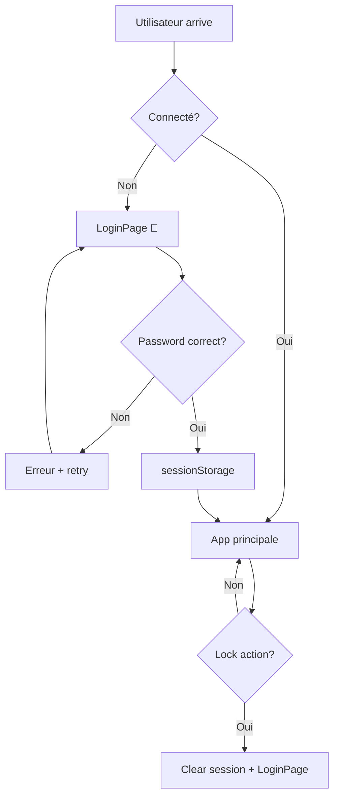

# ADR-008: Système de Sécurité Symbolique

**Date :** 1er octobre 2025
**Status :** Accepté
**Auteurs :** @Ricomaldo + Claude

## Contexte

IRIMMetaBrain étant un outil personnel de développeur, le besoin de sécurité réel est limité mais une protection basique est nécessaire pour :
- **Accès accidentel** : Empêcher collègues/famille d'accéder par erreur
- **Démos publiques** : Protection lors de présentations/screenshots
- **Environnements partagés** : Filtrage d'accès sur postes communs
- **UX élégante** : Interface cohérente avec le thème château 🏰

**Contrainte :** Éviter la complexité d'une sécurité cryptographique avancée tout en offrant une expérience utilisateur fluide.

## Décision

### Architecture Sécurité Symbolique

**Principe :** Protection légère, élégante, non-intrusive contre l'accès non autorisé



### Composants Architecture

#### 1. AccessGate (Wrapper de protection)
```javascript
// App.jsx - Protection globale
<AccessGate>
  <StudioHall />        // Desktop
  <CompanionApp />      // Mobile
</AccessGate>

// État et logique
const [isLoggedIn, setIsLoggedIn] = useState(false)
const [isChecking, setIsChecking] = useState(true)

// Vérification session au chargement
useEffect(() => {
  const loggedIn = sessionStorage.getItem('irim-logged-in') === 'true'
  setIsLoggedIn(loggedIn)
  setIsChecking(false)
}, [])
```

#### 2. LoginPage (Interface de connexion)
```javascript
// Design cohérent avec thème
<LoginContainer>
  <LoginCard>
    <LogoSection>
      <CastleIcon>🏰</CastleIcon>
      <Title>IRIM MetaBrain</Title>
      <Subtitle>Meta-cerveau spatial pour développeurs TDA/H</Subtitle>
    </LogoSection>

    <LoginForm onSubmit={handleLogin}>
      <PasswordInput placeholder="Mot de passe d'accès" />
      <LoginButton>Accéder</LoginButton>
    </LoginForm>

    <Footer>Accès restreint • Sécurité symbolique</Footer>
  </LoginCard>
</LoginContainer>
```

#### 3. LockButton (Déconnexion rapide)
```javascript
// ControlTower.jsx - Bouton de verrouillage
<LockButton onClick={handleLock} title="Verrouiller l'accès">
  🔒
</LockButton>

// Logique déconnexion
const handleLock = () => {
  const confirm = window.confirm('Verrouiller l\'accès à IRIMMetaBrain ?')
  if (confirm) {
    sessionStorage.removeItem('irim-logged-in')
    setIsLoggedIn(false)
  }
}
```

### Configuration

**Variable d'environnement unique :**
```bash
# .env.local
VITE_ACCESS_PASSWORD=votre_mot_de_passe_app

# Fallback si non défini
const password = import.meta.env.VITE_ACCESS_PASSWORD || 'metabrain2024'
```

**Session Storage :**
```javascript
const SESSION_KEY = 'irim-logged-in'

// Stockage connexion (temporaire par onglet)
sessionStorage.setItem(SESSION_KEY, 'true')

// Vérification statut
const isLoggedIn = sessionStorage.getItem(SESSION_KEY) === 'true'

// Déconnexion
sessionStorage.removeItem(SESSION_KEY)
```

## Alternatives Considérées

### Alternative 1: Sécurité Cryptographique Avancée
- **Exemples :** 2FA, OAuth, JWT, chiffrement localStorage
- **Avantages :** Sécurité militaire, audit trail
- **Inconvénients :** Complexité excessive, UX lourde, maintenance
- **Rejeté :** Over-engineering pour usage personnel

### Alternative 2: Pas de Sécurité
- **Avantages :** Simplicité maximale, pas de friction
- **Inconvénients :** Accès accidentel, problème démos publiques
- **Rejeté :** Besoin minimal de filtrage d'accès

### Alternative 3: localStorage Persistant
- **Avantages :** Connexion mémorisée entre sessions
- **Inconvénients :** Sécurité réduite, accès permanent
- **Rejeté :** sessionStorage plus sécurisé (effacé à fermeture)

### Alternative 4: Protection par URL Secrète
- **Exemples :** `/app/secret-token-xyz`
- **Avantages :** Simple, pas d'UI supplémentaire
- **Inconvénients :** URLs complexes, partage difficile
- **Rejeté :** UX moins élégante

## Conséquences

### ✅ Positives
- **UX élégante** : Interface cohérente avec thème château
- **Setup simple** : Une seule variable d'environnement
- **Sécurité raisonnable** : Protection accès accidentel efficace
- **Performance** : Zero impact sur l'app principale
- **Multi-device** : Même système desktop + mobile
- **Debug friendly** : Session visible dans DevTools

### ⚠️ Négatives
- **Sécurité limitée** : Pas de protection contre attaques ciblées
- **Re-login fréquent** : sessionStorage effacé à fermeture onglet
- **Configuration requise** : Setup .env.local nécessaire
- **Multi-onglet** : Re-login par onglet

### 🔄 Mitigations
- **Documentation claire** : Guide environment-setup.md
- **Messages explicites** : "Sécurité symbolique" affiché
- **Fallback robuste** : Mot de passe par défaut si variable absente
- **UX smooth** : Animations, délais réalistes, gestion erreurs

## Implémentation

### Structure Code
```
src/components/auth/
├── AccessGate.jsx          # Wrapper validation accès
├── LoginPage.jsx           # Interface connexion
└── LockButton.jsx          # Bouton déconnexion ControlTower
```

### Design System
```css
/* Cohérence avec thème principal */
--login-bg: var(--colors-metalBg)          /* Fond métallique */
--login-card: var(--colors-primaryLevel)   /* Carte principale */
--login-accent: var(--colors-primary)      /* Accent château */
--login-error: var(--colors-danger)        /* Messages erreur */

/* Animations élégantes */
.login-card {
  animation: slideUp 0.5s ease-out;
}

.error-message {
  animation: shake 0.3s ease-in-out;
}
```

### Validation Logique
```javascript
const handleLogin = (e) => {
  e.preventDefault()
  setIsLoading(true)
  setError('')

  // Délai réaliste pour UX (simulation authentification)
  setTimeout(() => {
    if (password === SIMPLE_PASSWORD) {
      sessionStorage.setItem('irim-logged-in', 'true')
      onLogin() // Callback vers App.jsx
    } else {
      setError('Mot de passe incorrect')
      setPassword('') // Clear pour retry
    }
    setIsLoading(false)
  }, 800)
}
```

## Sécurité et Bonnes Pratiques

### Variables d'Environnement
```bash
# ✅ Recommandé
VITE_ACCESS_PASSWORD=MonApp2024!
VITE_ACCESS_PASSWORD=StudioHall-Access
VITE_ACCESS_PASSWORD=IRIM_MetaBrain_2024

# ❌ À éviter (trop faibles)
VITE_ACCESS_PASSWORD=123456
VITE_ACCESS_PASSWORD=password
VITE_ACCESS_PASSWORD=admin
```

### Rotation Mots de Passe
```bash
# 1. Changer dans .env.local
VITE_ACCESS_PASSWORD=nouveau_mot_de_passe

# 2. Redémarrer serveur dev
npm run dev

# 3. Informer utilisateurs du changement
# 4. Mettre à jour environnements prod
```

### Production
```bash
# Variables requises en production
VITE_ACCESS_PASSWORD=production_password_secure

# Considérations
✅ HTTPS obligatoire en production
✅ Mots de passe différents dev/prod
✅ Pas de mot de passe par défaut en prod
❌ Jamais committer .env.local
```

## Debug et Maintenance

### Commandes Debug
```javascript
// Console navigateur
console.log('Session état:', sessionStorage.getItem('irim-logged-in'))
console.log('Password env:', !!import.meta.env.VITE_ACCESS_PASSWORD)

// Forcer déconnexion
sessionStorage.removeItem('irim-logged-in')
window.location.reload()

// Forcer connexion (dev uniquement)
sessionStorage.setItem('irim-logged-in', 'true')
window.location.reload()
```

### Reset d'Urgence
```javascript
// Clear toutes les sessions
const emergencyReset = () => {
  sessionStorage.clear()
  localStorage.clear()
  window.location.reload()
}

// Accessible via console dev
window.emergencyReset = emergencyReset
```

## Cas d'Usage et Limites

### ✅ Efficace Pour
- Empêcher collègues/famille d'accéder par erreur
- Protection basique en démo/présentation
- Filtre d'accès pour environnements partagés
- Interface élégante cohérente avec thème

### ❌ Inefficace Contre
- Attaques ciblées déterminées
- Inspection code source
- Bypass technique JavaScript
- Sécurité niveau entreprise/gouvernemental

### 🎯 Public Cible
**Développeurs solos/petites équipes** recherchant protection basique avec UX élégante

## Évolutions Futures

### v1.1 - Améliorations UX
- [ ] Délai progressive après échecs répétés
- [ ] Remember device (localStorage optionnel)
- [ ] Thème dark/light pour LoginPage
- [ ] Animations de transition améliorées

### v1.2 - Fonctionnalités
- [ ] Multi-passwords (admin/user)
- [ ] Session expiry configurable
- [ ] Logs des tentatives de connexion
- [ ] Interface admin pour gestion accès

### v2.0 - Sécurité Avancée (si besoin futur)
- [ ] Authentification 2FA optionnelle
- [ ] Intégration OAuth GitHub/Google
- [ ] Chiffrement local avec mot de passe
- [ ] Audit logs complets

## Liens

- **[Security System Architecture](../architecture/security-system.md)** - Documentation technique complète
- **[Environment Setup](../guides/environment-setup.md)** - Configuration variables d'env
- **[Companion Architecture](../COMPANION_ARCHITECTURE.md)** - Sécurité mobile partagée

---

**Décision validée le :** 1er octobre 2025
**Implémentation :** ✅ Production Ready
**Type de Sécurité :** 🟡 Symbolique (Basic Protection)
**Review prévue :** T2 2025 (retours utilisateurs)