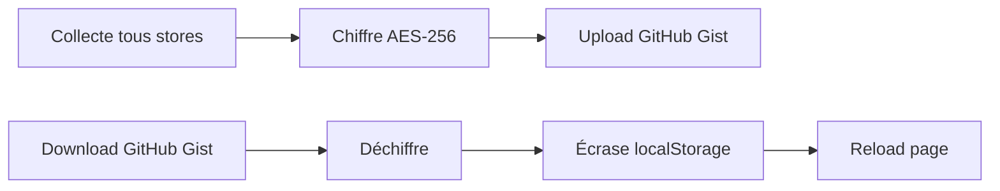

# 🔄 Système de Synchronisation Ultra-Simple - Documentation v3.0

> Synchronisation chiffrée GitHub Gist avec 2 boutons seulement

**Dernière mise à jour :** 1er octobre 2025
**Version :** 3.0.0 (Architecture Ultra-Simple)

⚠️ **Note :** Cette version remplace complètement l'architecture complexe v2.0. Pour une explication détaillée de l'architecture stores, consultez [Architecture Stores](../architecture/stores-architecture.md)

## 🎯 Vue d'ensemble Ultra-Simple

### Interface 2 boutons uniquement
```
📤 EXPORT  →  Sauvegarde TOUT vers GitHub Gist chiffré
📥 IMPORT  →  Restaure TOUT depuis GitHub Gist + reload page
```

### Flow ultra-simplifié


## 🚀 Setup Rapide (5 minutes)

### 1. Variables d'environnement requises

Créer `.env.local` à la racine :

```bash
# GitHub Personal Access Token (scope "gist")
# Obtenir sur: https://github.com/settings/tokens
VITE_GITHUB_TOKEN=ghp_votre_token_ici

# Mot de passe chiffrement (min 8 caractères, complexe recommandé)
VITE_SYNC_PASSWORD=VotreMotDePasseComplexe123!

# ID Gist (optionnel - créé automatiquement au premier export)
VITE_SYNC_GIST_ID=votre_gist_id_optionnel

# Mot de passe accès app (sécurité symbolique)
VITE_ACCESS_PASSWORD=votre_mot_de_passe_app
```

### 2. Obtenir GitHub Token

1. **GitHub** → Settings → Developer settings
2. **Personal access tokens** → Tokens (classic)
3. **Generate new token (classic)**
4. **Scope requis :** ✅ `gist` (Create gists)
5. **Expiration :** 90 days recommandé
6. Copier le token dans `VITE_GITHUB_TOKEN`

### 3. Premier usage

1. **Redémarrer le serveur dev** (pour charger les variables d'env)
2. Cliquer **🔄** dans ControlTower → **Synchronisation**
3. Si tout est configuré : **2 boutons actifs**
4. Sinon : **Message d'erreur configuration**

## 📤 Export (Sauvegarde)

### Interface utilisateur
1. Cliquer **📤 EXPORT**
2. Messages en temps réel :
   - "Collecte des données..."
   - "Upload vers GitHub..."
   - "✅ Export réussi! Gist ID: xxx"
3. **Gist ID automatiquement copié** dans presse-papier
4. **Modale se ferme automatiquement** après 3 secondes

### Sous le capot
```javascript
// Collecte TOUS les stores depuis localStorage
const data = {
  version: '2.0.0',
  stores: {
    notes: {...},           // useNotesStore
    projectMeta: {...},     // useProjectMetaStore
    projectData: {...},     // tous project-data-*
    diary: {...},          // useDiaryStore (nouveau)
    preferences: {...}     // usePreferencesStore (nouveau)
  }
}

// Chiffre avec AES-256 + mot de passe
const encrypted = CryptoJS.AES.encrypt(JSON.stringify(data), password)

// Upload vers GitHub Gist privé
const gist = await uploadToGist(encrypted)
```

## 📥 Import (Restauration)

### Interface utilisateur
1. Cliquer **📥 IMPORT**
2. **Confirmation obligatoire** : "⚠️ ATTENTION: L'import va remplacer TOUTES vos données locales"
3. Messages en temps réel :
   - "Téléchargement depuis GitHub..."
   - "Restauration des données..."
   - "✅ Import réussi! Rechargement..."
4. **Page rechargée automatiquement** après 2 secondes

### Sous le capot
```javascript
// Download depuis GitHub Gist
const encrypted = await downloadFromGist(gistId)

// Déchiffre avec même mot de passe
const data = CryptoJS.AES.decrypt(encrypted, password)

// Écrase TOUT localStorage
localStorage.setItem('project-meta-store', JSON.stringify(data.stores.projectMeta))
localStorage.setItem('diary-storage', JSON.stringify(data.stores.diary))
// ... tous les autres stores

// Reload forcé pour recharger l'état complet
window.location.reload()
```

## 🔒 Sécurité

### Chiffrement
- **Algorithme** : AES-256 (CryptoJS)
- **Mot de passe** : Variable d'environnement uniquement
- **GitHub Gist** : Privé (non listé publiquement)

### Données sensibles
- **Token GitHub** : Jamais stocké dans localStorage
- **Mot de passe** : Jamais stocké, uniquement en mémoire
- **Gist privé** : Accessible uniquement avec token

### Protection locale
- **LoginPage** : Mot de passe `VITE_ACCESS_PASSWORD`
- **SessionStorage** : État connexion temporaire
- **Variables d'env** : Jamais committées (.env.local dans .gitignore)

## ⚡ Stores Synchronisés

### Architecture Multi-Stores v2.0
```
✅ useNotesStore          → Notes transversales rooms/tower
✅ useProjectMetaStore    → Métadonnées projets (kanban, visibilité)
✅ useProjectDataStore    → Données par projet (roadmap, todo, notes)
✅ useDiaryStore          → Journal personnel (mindlog, archives)
✅ usePreferencesStore    → Préférences UI (rooms, navigation)
```

### Données exclues
```
❌ Sessions temporaires (modales ouvertes, etc.)
❌ Cache navigateur
❌ Variables d'environnement (.env.local)
❌ États UI éphémères (focus, scroll, etc.)
```

## 🛠 Configuration Avancée

### Gist ID optionnel
- **Non défini** : Nouveau Gist créé automatiquement au premier export
- **Défini** : Met à jour le Gist existant (recommandé pour setup multi-device)

### Rotation des tokens
1. Générer nouveau token GitHub (même scope)
2. Mettre à jour `VITE_GITHUB_TOKEN`
3. Redémarrer serveur dev
4. Export/Import fonctionnent immédiatement

### Backup manuel
```javascript
// Console navigateur - backup JSON non chiffré
const backup = {
  projectMeta: JSON.parse(localStorage.getItem('project-meta-store')),
  notes: JSON.parse(localStorage.getItem('irim-notes-store')),
  diary: JSON.parse(localStorage.getItem('diary-storage')),
  preferences: JSON.parse(localStorage.getItem('irim-preferences-store'))
}
console.log(JSON.stringify(backup, null, 2))
```

## 🐛 Diagnostic et Debug

### Messages d'erreur communes

#### "❌ Configuration manquante"
- **Cause** : Variables d'env absentes ou mal nommées
- **Solution** : Vérifier `.env.local` et redémarrer serveur

#### "❌ Erreur chiffrement: CryptoJS non disponible"
- **Cause** : Import CryptoJS échoué
- **Solution** : Vérifier `npm install crypto-js`

#### "❌ GitHub API error: 401"
- **Cause** : Token expiré ou invalide
- **Solution** : Régénérer token avec scope "gist"

#### "❌ Erreur déchiffrement"
- **Cause** : Mot de passe incorrect ou données corrompues
- **Solution** : Vérifier `VITE_SYNC_PASSWORD` identique

#### "❌ VITE_SYNC_GIST_ID manquant pour l'import"
- **Cause** : Gist ID non défini et aucun export préalable
- **Solution** : Faire un export d'abord ou définir Gist ID existant

### Debug localStorage
```javascript
// Voir toutes les clés projet
Object.keys(localStorage).filter(k => k.includes('project'))

// Taille des données
const getSize = key => (localStorage.getItem(key)?.length || 0) / 1024
console.log(`Meta: ${getSize('project-meta-store')} KB`)
console.log(`Notes: ${getSize('irim-notes-store')} KB`)
console.log(`Diary: ${getSize('diary-storage')} KB`)
```

### Réinitialisation complète
```javascript
// Vider localStorage (perte de données !)
localStorage.clear()
window.location.reload()

// Ou depuis console dev tools
window.__SYNC_TOOLS__.cleanupOrphanedProjects()
```

## 🔄 Migration depuis v2.0

### Détection automatique
Le système détecte automatiquement l'ancien format complexe et bascule vers l'interface ultra-simple.

### Données préservées
- ✅ Tous les projets et métadonnées
- ✅ Notes et configurations
- ✅ Historique et préférences
- ✅ Gists existants compatibles

### Changements interface
- ❌ Plus de configuration manuelle token/password
- ❌ Plus d'options avancées (liste Gists, test connexion)
- ❌ Plus de gestion multi-Gists
- ✅ Variables d'environnement uniquement
- ✅ 2 boutons simples
- ✅ Feedback amélioré

## 📊 Performance

### Taille données typiques
- **4 projets complets** : ~50-100 KB
- **Chiffrement** : +30% taille
- **Gist limite** : 1 MB par fichier (largement suffisant)

### Temps de sync typiques
- **Export** : 2-5 secondes (collecte + chiffre + upload)
- **Import** : 3-7 secondes (download + déchiffre + write + reload)

## 🚀 Évolutions v3.1 Prévues

### Auto-sync (à venir)
- Variables `VITE_AUTO_SYNC_ENABLED` et `VITE_AUTO_SYNC_INTERVAL`
- Sync automatique toutes les X minutes
- Indicateur de statut temps réel

### Sync sélective (à venir)
- Choisir quels stores synchroniser
- Export partiel (projets spécifiques)
- Import non destructif (merge intelligent)

---

**Mainteneurs :** IRIM Team
**Statut :** ✅ Production Ready (v3.0.0)
**Migration depuis v2.0 :** ✅ Automatique et transparente